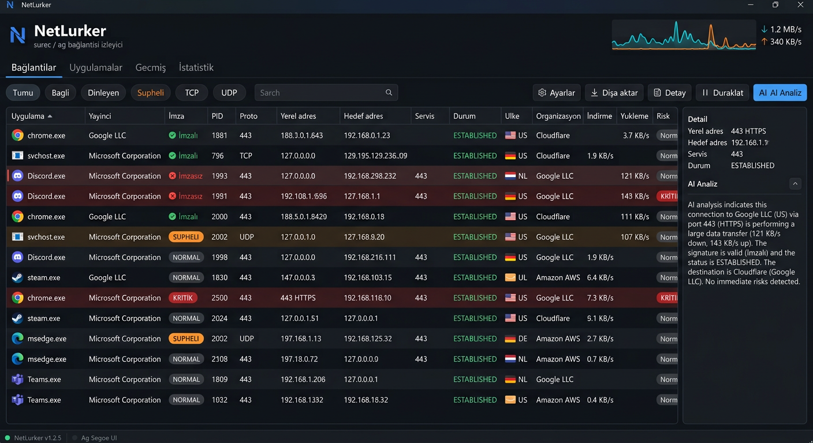

# NetLurker — Real-time Windows Network Intelligence

**See which applications are connecting to the internet, where they're connecting,
and whether those destinations look suspicious.**

[Türkçe README](README.tr.md)

NetLurker turns the raw socket tables of Windows into actionable network intelligence:
process attribution, digital signatures, geolocation, threat feeds, TLS inspection and
behavioral baselines — in one dark, keyboard-driven, dependency-free window.

Pure **C++17 + Win32**, a single portable x64 executable. No installation.
No data collection, no telemetry, no account.



---

## Why NetLurker?

Your antivirus makes a verdict about a *file*; NetLurker shows you the **evidence about
the network**: which process talks to which destination, whether the binary is signed,
whether the target is a data center, whether it is on a DNS blacklist, whether its
certificate is sound, whether it talks more than it usually does. One click turns that
evidence into a **structured analyst report**.

## Features

- **Real-time connections** — TCP/TCP6/UDP/UDP6 sockets mapped to their processes;
  state, rate (KB/s), RTT, total bytes and service name update live.
- **Process intelligence** — Authenticode signature, publisher, command line, user,
  parent process, svchost service, owning DLL, SHA-256, integrity level.
- **Threat intelligence** — AbuseIPDB, 5 DNS blacklists, CIRCL passive DNS,
  RDAP ownership, VirusTotal (optional key), HTTP banner/EOL.
- **DNS · TLS · RDAP analysis** — DNS cache/hosts matching, TLS certificate inspection
  through a hand-written ClientHello (self-signed, expired, rDNS mismatch), network
  ownership and abuse contact.
- **AI-assisted investigation** — `Enter` turns the evidence into a report structured as
  **VERDICT / CONFIDENCE / WHY / CONCERNS / RECOMMENDATION / STEPS**. Without an API key
  the local heuristic engine produces the same structure and says so plainly
  ("offline heuristic analysis — local rule engine, not a language model").
  Three follow-up actions sit under the report: **"Why suspicious?"**, **"What should I
  do?"** and **"Deviation from normal?"** (comparison against the process baseline).
  **The model answers in the language of the UI** — English UI, English report.
- **One-click block / unblock** — a `⛔ Block IP` button in the toolbar (and
  **Block in Windows Firewall** in the right-click menu) adds the outbound rule; the same
  button turns into `⛔ Unblock IP` once the rule is live.
- **Reputation lookups in one click** — right-click → **Open in VirusTotal**,
  **Check on AbuseIPDB**, **Open passive DNS records (CIRCL)** for the destination IP, and
  **Check file hash (SHA-256) on VirusTotal** for the owning executable; each opens the
  analysis page directly in your default browser.
- **Block and unblock destinations** — right-click a connection to add a Windows Firewall
  outbound block rule, then verify it: NetLurker reads the live rule list back through the
  Windows Firewall COM API, marks blocked rows with `⛔`, shows *"blocked by a NetLurker
  rule"* in the detail panel, counts active rules on the Stats tab, and offers
  **Remove firewall block for this IP** on the same menu. A rule is only reported as
  created if it is actually there afterwards.
- **Network graph** — process ↔ destination graph: risk-colored nodes, thickness = data
  flow, country labels.
- **Behavioral anomaly detection** — per-process connection baseline (EMA + variance);
  deviation above 3σ → alert + notification + report entry.
- **Search, filter, sort** — free-text search, filter chips
  (All / Connected / Internet / Listening / Suspicious / HTTPS / Unsigned /
  Unknown / New / TCP / UDP) and sorting on 25 columns.
- **Exports** — `Ctrl+E`: **JSON, CSV, HTML security report, TXT** — in the current
  language, with a KPI summary and an anomaly section.
- **8 languages** — English (default), Türkçe, Español, Deutsch, Français,
  日本語, 中文, Português. Interface, errors, risk reasons, column headers, tooltips,
  duration units, AI prompts, reports and export headers included — 687 catalog keys,
  verified in CI (`python3 tools/gen_lang.py --check`).

## Honest data, or none at all

A monitoring tool is only worth as much as its trustworthiness, so NetLurker never
fills gaps with invented or aged values:

| Situation | What you see |
|---|---|
| Lookup still running | `querying…` (never a stale or empty value pretending to be a result) |
| Enrichment failed / offline | `(lookup failed)` / `(offline)` — retried with exponential backoff (20 s → 10 min) and **never written to the disk cache** |
| Connectivity returns | pending and failed records are re-queued immediately, not after 24 h |
| Geo/threat record older than 24 h | discarded and re-queried; every detail panel shows `Data age: fetched 14:32 (3 min ago)` |
| Per-connection bytes/RTT unavailable (no admin, non-TCP) | `n/a` and *"total/RTT: not measurable (requires administrator rights)"* — not `0` |
| No AI key | output is labeled as a local rule engine, not as a model answer |
| Connection age / duration | taken from the kernel socket creation timestamp, so a socket opened hours before NetLurker started still reports its real age; when Windows withholds the timestamp the value is prefixed with `≥` to mark it as a lower bound |
| Anomaly baseline | measured as **new** outbound connections per minute over a real ≥15 s window — a process that merely keeps sockets open no longer inflates its own rate |
| Traffic graphs | plotted against real timestamps over a fixed 5 min (system) / 2 min (per app) window; pauses, throttled background ticks and machine sleep show up as gaps instead of an invented straight line, and the per-app graph is labelled with the span it actually covers |
| Rate counters after sleep/wake or a long stall | discarded for that cycle instead of dividing hours of bytes by one second and reporting a fake spike |
| Per-app traffic graph without admin rights | says *"not measurable (requires administrator rights)"* instead of drawing a flat zero line |
| TLS certificate / HTTP banner | re-fetched after 24 h instead of being served from a week-old cache, and each detail row states when it was fetched |
| LAN device count | reports ARP table entries and how many are *actually reachable right now*, so devices that left the network hours ago are not counted as present |
| Collection slower than the refresh interval | the interval backs off automatically and the status bar says so (`refresh auto-slowed to 2.4 s (collection takes 810 ms)`) instead of silently queueing late frames |
| Firewall block result | verified against the live Windows Firewall rule list instead of trusting `netsh`'s exit code — a declined UAC prompt or a policy-managed firewall now says the rule was **not** created |
| Refresh falling behind | the status-bar clock turns red and shows how many seconds old the data is (`⟳ 14:32:07 (+7s)`) |
| Demo mode | a **DEMO ENVIRONMENT** band, a status-bar marker, and a warning banner in every export |

## Screenshots

A real screenshot taken from the running program:


> **Honesty note:** `docs/landing/hero.png` is a **UI concept illustration**, not a
> screenshot; it is used for decoration on the landing page and labeled as such there.
> Everything the application displays is real system data; demo-mode data is marked
> "DEMO" everywhere. For recording a GIF/video, see
> [docs/video/STORYBOARD.md](docs/video/STORYBOARD.md).

## Demo

**Demo mode** (`Ctrl+D`): try the whole program in 30 seconds without any API key.
An 8-connection realistic data set — signed browsers, DNS, Windows Update and
suspicious samples (unsigned `updater.exe` → data center 88/100, C2 beacon pattern,
hosts redirect). A **DEMO ENVIRONMENT** band on the Summary tab; leave with one click.

## Installation

| | |
|---|---|
| Operating system | Windows 7 SP1+ / Windows 10 / Windows 11 (x64) |
| Download | [Releases](https://github.com/thesyntax11/NetLurker/releases) → `NetLurker-vX.Y.Z-win64.zip`, or the ready-made `dist/NetLurker-portable-win64.zip` in this repository |
| Installation | Not required (portable): unzip and run `NetLurker.exe`. For a real installer build `installer/NetLurker.iss` with Inno Setup 6 (`iscc installer\NetLurker.iss`) — it produces `dist/NetLurker-vX.Y.Z-setup.exe` |
| Elevation | The executable starts as the invoking user and asks on first launch whether to relaunch elevated; per-connection rates, process termination and firewall rules need administrator rights |
| Requirements | ~2 MB disk, internet connection (works offline too, without enrichment) |
| Language packs | the `lang\` folder next to `NetLurker.exe` (included in the zip) |

### Build from source

One executable, three toolchains:

| Method | Command | Requirement |
|---|---|---|
| MSVC | `build.bat` (inside "x64 Native Tools") | Visual Studio 2019+ |
| MinGW-w64 | `build_mingw.bat` | MSYS2 `mingw-w64-x86_64-toolchain` |
| Zig (cross) | `ZIG=zig ./tools/build_zig.sh` | Zig 0.14+ / `pip install ziglang` |

Regenerate the language catalog: `python3 tools/gen_lang.py`
(verify without writing: `python3 tools/gen_lang.py --check`)

## Configuration

Settings window (`Ctrl+S`) or `%APPDATA%\NetLurker\config.ini`:

| Setting | Description |
|---|---|
| `[ai] endpoint/model/api_key` | OpenAI-compatible API (empty = local heuristic analysis) |
| `[ui] lang` | `en` (default), `tr`, `es`, `de`, `fr`, `ja`, `zh`, `pt`, `system` |
| `[ui] interval` | Refresh interval (×100 ms) |
| `[ui] geo/threat/rdap/banner` | External lookup switches (mirrored in the Privacy Center) |
| `[threat] abusekey` / `[threat] vtkey` | Optional API keys |

Plugin providers: `plugins\*.json` → [docs/PLUGINS.md](docs/PLUGINS.md)

## Privacy

| Promise | Status |
|---|---|
| Network data is processed locally | ✅ never leaves the device |
| Telemetry / analytics / ads | ✅ none |
| Account or registration | ✅ not required |

External services are queried **only when you enable them**; the in-app
**Privacy Center** shows the state of every provider:

| Provider | When | Type |
|---|---|---|
| ip-api.com | Geography/ASN/organization | ✓ built-in |
| DNS blacklists (Spamhaus, Blocklist.de, Sorbs, Barracuda, UCEPROTECT) | Threat score | ✓ built-in |
| CIRCL passive DNS | IP history | ✓ built-in |
| rdap.org | Network ownership | ✓ built-in |
| AbuseIPDB | Abuse score | ○ optional key |
| VirusTotal | Community detections | ○ optional key |
| TLS ClientHello / HTTP HEAD | One request to the destination | ✓ built-in |
| **plugins/\*.json** | Your own source | ○ you define it |

## Why does it ask for administrator rights?

NetLurker also runs as a normal user. Elevation is only for APIs Windows protects:
per-connection rate/RTT, process termination, firewall IP blocking, and the TCP table of
all system processes. NetLurker does not use elevation to collect data and does not
change your network configuration. Clicking the yellow warning in the status bar shows
this rationale with two options: **Continue as administrator** /
**Continue without elevation**.

## Releases & integrity

- A GitHub Actions build for every `vX.Y.Z` tag, zip + `SHA256SUMS`.
  (Workflow: `tools/release.workflow.yml` → `.github/workflows/release.yml`)
- Verify integrity:
  ```powershell
  Get-FileHash .\NetLurker.exe -Algorithm SHA256
  ```
- Code-signing helper: `tools/sign_release.ps1` (signtool + verification).
  Details: [docs/RELEASES.md](docs/RELEASES.md)

**Current build SHA-256** (`dist/NetLurker.exe` in this repository):

```
b8d6c2b83bd1855f1a6bf2c2b19f29266621f548cb8abf26eb53eacb5db3168d
```

## Architecture

```
src/
├── main.cpp      window, tabs, drawing, filter/search, export,
│                 demo mode, graph, anomalies, privacy center
├── netmon.cpp    TCP/UDP tables, process mapping, risk engine (0–100, MITRE)
├── procinfo.cpp  signature/publisher/service/user/module/resource tracking
├── threat.cpp    AbuseIPDB + DNSBL + CIRCL + RDAP + VirusTotal workers
├── plugins.cpp   external JSON provider plugins (stdin IP → stdout JSON)
├── cert.cpp      TLS certificate analysis (hand-written ClientHello)
├── dns.cpp       DNS cache + hosts redirect detection
├── geo.cpp       ip-api batch geolocation + disk cache + freshness/backoff
├── banner.cpp    HTTP banner / EOL detection
├── history.cpp   history of closed connections
├── ai.cpp        OpenAI-compatible client + local heuristic analysis
├── i18n.cpp      zero-dependency multi-language dictionary (lang/*.ini)
├── wifi.cpp      wireless network info (WLAN API, conditional load)
└── ui_draw.cpp   GDI+ based dark theme drawing layer
```

Worker model: every provider is fed from a queue on its own thread; results are cached
on disk (geoip 7 days, threat 7 days) and revalidated after 24 hours. Failed lookups are
never cached to disk. Heavy work (signature, SHA-256, AI) never blocks the UI thread.

## Roadmap

→ [docs/ROADMAP.md](docs/ROADMAP.md)

- **v6 (current):** 8-language i18n, first-run experience, demo mode, network graph,
  behavioral anomalies, HTML/TXT report, plugin system, privacy center,
  release/signing infrastructure, landing page.
- **v7:** ETW sensor, per-process traffic history, rule editor, syslog forwarding.
- **v8:** KMDF driver monitoring, MITRE ATT&CK tactic mapping, rule packs.

## FAQ

**Windows Defender / SmartScreen warned me?** That is normal for an unsigned open-source
executable. Verify the SHA-256; the signing steps for a signed build are ready in
[docs/RELEASES.md](docs/RELEASES.md).

**Where does my data go?** Nowhere. Only local caches and settings are kept under
`%APPDATA%\NetLurker\`.

**Is an AI key mandatory?** No. Without a key the local heuristic analysis runs in the
same structured format — and it is labeled as such, never presented as a model answer.

**Connection rates show "n/a"?** Per-connection rates require administrator mode (the
rationale dialog explains why). The system-wide graph always works.

## Contributing

1. Fork, branch from `main`.
2. If you added a new interface string, wrap it in `Tr(L"...")` and refresh the catalog
   with `python3 tools/gen_lang.py` (CI runs `--check`).
3. Build with one of the three toolchains; open a PR.

Writing a plugin is the easiest way to contribute: [docs/PLUGINS.md](docs/PLUGINS.md)

## License

[MIT](LICENSE) — use it, change it, distribute it. Only run a network monitoring tool on
systems you are authorized to monitor.

---

*NetLurker relies on heuristic rules; it is not a verdict. Always evaluate suspicious
findings in context.*
